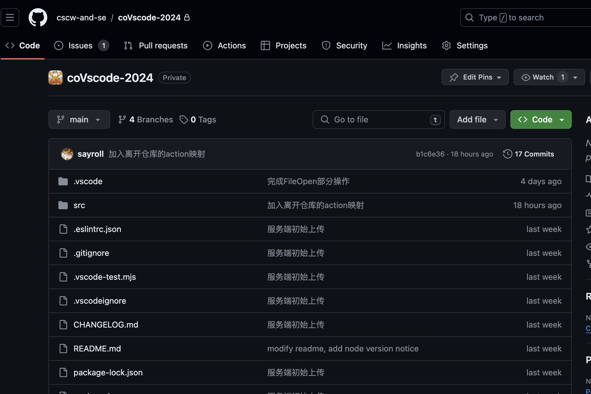

# 项目说明

在本部分，我们将初步了解项目的整体架构。

## 技术栈

这里演示放了一张图片会长什么样。

You can add markdown files in your vuepress directory, every markdown file will be converted to a page in your site.

See [routing][routing] for more details.

## Content

Every markdown file [will be rendered to HTML, then converted to a Vue SFC][content].

VuePress support basic markdown syntax and [some extensions][synatex-extensions], you can also [use Vue features][vue-feature] in it.

## Configuration

VuePress use a `.vuepress/config.js`(or .ts) file as [site configuration][config], you can use it to config your site.

For [client side configuration][client-config], you can create `.vuepress/client.js`(or .ts).

Meanwhile, you can also add configuration per page with [frontmatter][frontmatter].

## Layouts and customization

Here are common configuration controlling layout of `@vuepress/theme-default`:

- [navbar][navbar]
- [sidebar][sidebar]

Check [default theme docs][default-theme] for full reference.

You can [add extra style][style] with `.vuepress/styles/index.scss` file.

[routing]: https://vuejs.press/guide/page.html#routing
[content]: https://vuejs.press/guide/page.html#content
[synatex-extensions]: https://vuejs.press/guide/markdown.html#syntax-extensions
[vue-feature]: https://vuejs.press/guide/markdown.html#using-vue-in-markdown
[config]: https://vuejs.press/guide/configuration.html#client-config-file
[client-config]: https://vuejs.press/guide/configuration.html#client-config-file
[frontmatter]: https://vuejs.press/guide/page.html#frontmatter
[navbar]: https://vuejs.press/reference/default-theme/config.html#navbar
[sidebar]: https://vuejs.press/reference/default-theme/config.html#sidebar
[default-theme]: https://vuejs.press/reference/default-theme/
[style]: https://vuejs.press/reference/default-theme/styles.html#style-file
